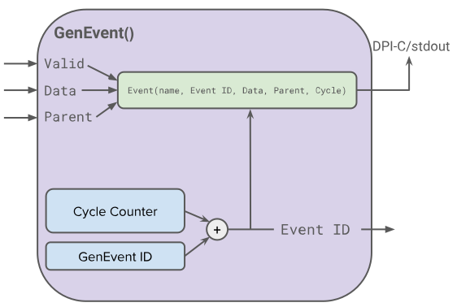

Iris Event Annotation Tools
=======================
Iris (uArchDB) provides a set of tools for extracting microarchitecture events and data in RTL for debugging and analysis. 

## GenEvent Module

The GenEvent module written in CHISEL HDL and allows users to annotate their own modules to log timing and signal data at an event level. GenEvent implements a DPI interface for efficient logging.
### Importing GenEvent
The GenEvent module can be imported by adding
```scala
import genevent._
```
to each project file where it is instantiated.

To build GenEvent, add `iris_event_utils` to the dependecies of your project in the top-level Chipyard `build.sbt`.

For example, `iris_event_utils` added to Sodor:
```scala
lazy val sodor = (project in file("generators/riscv-sodor"))
  .dependsOn(rocketchip, iris_event_utils)
  .settings(libraryDependencies ++= rocketLibDeps.value)
  .settings(commonSettings)
```
### Adding GenEvent to a Module
Each GenEvent instance has a
- Event Name string `eventName`
- 64 bit Data input `data`
- Valid input `valid`
- Optional 64 bit Parent Tag ID input `parent`
- Optional 64 bit Instance Tag ID input `id`, defaults to `None`
- 64 bit Tag ID output

A GenEvent instance records the `eventName`, a unique tag, cycle, `parent` tag, and `data` for an event every cycle when `valid` is high. 

#### EventTag and Event Graph
EventTag's are 64 bit values that uniquely identify an event in the log. Each GenEvent instance generates a unique tag output signal every cycle that is logged and can also be passed to the `parent` input of other GenEvent instances through RTL to form a parent-child relationship. Multiple GenEvent instances can be chained to form a graph of dependent events. 

Optionally, a tag can be passed to the `id` input. This will replace the uniquely generated tag in the log and can be useful if there is already a unique identifier in the RTL such as a transaction ID. The same ID can be passed to multiple GenEvent instances to chain the events chronologically.

Examples of a GenEvent declaration:
```scala
val tag = Wire(new EventTag)
tag := GenEvent("event_name", event_data, event_valid, Some(parent))

//If no parent:
tag := GenEvent("event_name", event_data, event_valid, None)

//If no valid, replace with true.B to log every cycle:
tag := GenEvent("event_name", event_data, true.B, None)

//If unique ID already exists in design, it can be input as last argument:
tag := GenEvent("event_name", event_data, event_valid, Some(parent), Some(id_reg))
```
Here, `tag` is the output of the `GenEvent`. A susbsequent `GenEvent` can use `tag` in place of `parent` in above to connect the two events. If not specified, `id` input is `None`.

#### Output Log Format
GenEvent outputs a plain text log with entries 
```
event_name <id> <parent> <cycle> <data>
```
See [GenEventLog.txt](./scripts/uarchdb/GenEventLog.txt) for a full 5-stage Sodor event log.
### Examples
Currently, Sodor, Rocket, and Gemmini have GenEvent annotations. More designs are on the way!

## Iris Script
[iris.py](./scripts/uarchdb/iris.py) is a post-processing script for GenEvent logs to generate waterfall visualizations. iris.py parses the GenEvent log and constructs the event graph using NetworkX and outputs a log which can be input into [Konata](https://github.com/shioyadan/Konata), an open-source Javascript waterfall viewer GUI. 

Arguments:
`--log_file`: GenEvent log filename
`--output_file`: Optional output file name. Defaults to `konata_output.log`
`--schema`: json input file specifying pipeline stages and associated data types. Needed for RISCV instruction decoding. See [sodor config schema](./scripts/uarchdb/sodor5.json). Schema contains event names, event data types, and start, split, and end stages of event graphs.
`--gemmini`: optional flag for turning on Gemmini instruction decoding

Usage:

```
cd scripts/uarchdb
python3 iris.py --log_file GenEventLog.txt --schema sodor5.json
```


